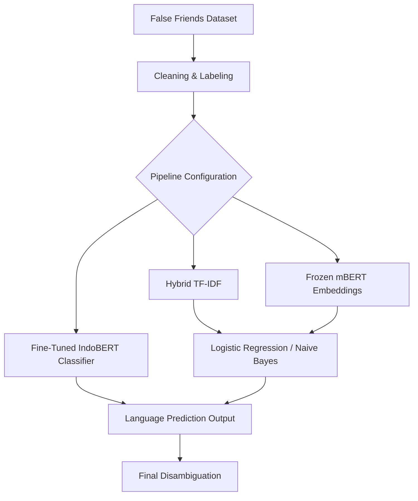

STINK3114 KUMP A NATURAL LANGUAGE PROCESSING
Semester II Session 2025/2026 (A252)

Model Implementation (Methodology)

Evaluating Cross-Lingual Semantic Understanding in Malay–Indonesian NLP Models.

Submitted by:
AZILA WAHIDA BINTI MOHD ARABEE (298980)
NURUL HIDAYAH BINTI FAIRUS (299105)
ANDYDERIS PUTRA AJI SYABANA (296530)

Submitted to:
DR. MUHAMMAD SYAFIQ BIN MOHD POZI

School of Computing
UNIVERSITI UTARA MALAYSIA

---

## 1. Overview of Approach
In this project, we aim to build an NLP model for cross-lingual semantic understanding between Malay and Indonesian. Our goal is to identify "false friends," which are words that look the same but have different meanings depending on whether they are used in Indonesia or Malaysia. This is a difficult task because both languages are very similar, so the model needs to understand the context around the word.

To achieve this, we implemented a classification pipeline that compares three different approaches:
1.  **Baseline Model**: Using a hybrid version of TF-IDF (Term Frequency-Inverse Document Frequency) with character and word n-grams.
2.  **Advanced Model (Feature Extraction)**: Using Multilingual BERT (mBERT) frozen embeddings combined with Logistic Regression.
3.  **Fine-Tuned Transformer (End-to-End)**: Fine-tuning a language-specific model (**IndoBERT**) end-to-end for sequence classification.

We also created an interactive Streamlit web application and terminal interface that allows users to input their own sentences and see real-time predictions with confidence scores using the fine-tuned model.

## 2. Model / Algorithm Description
We chose a multi-model approach to see which algorithm handles false friends best.

1.  **Logistic Regression & Naive Bayes**:
    These were used as our baseline models. They are very efficient for text classification. While they are simple, they provide a very clear baseline to compare against more complex models.
2.  **Multilingual BERT (mBERT)**:
    We initially implemented a frozen mBERT model to extract static sentence embeddings. Unlike word counters, mBERT understands the "meaning" of a sentence. However, frozen embeddings lack task-specific optimization.
3.  **Fine-Tuned IndoBERT**:
    To maximize accuracy, we fine-tuned `indobenchmark/indobert-base-p1` end-to-end. By updating the model's weights on our training set, the self-attention heads explicitly adapt to identify the subtle syntactic and contextual patterns that distinguish Malay usage from Indonesian usage.

We realized that fine-tuned IndoBERT is much better at solving the false friend problem because it adapts to local vocabulary differences and captures context-dependent meanings of false friends with higher sensitivity.

## 3. Pipeline / Workflow Diagram or Explanation
The data processing and model implementation follow the standard flow: **Data → Preprocessing → Feature Representation → Model → Output**.

**Data**:
The dataset consists of 501 paired lexical samples. We combined these into a balanced corpus of 1,000 sentences (500 Indonesian and 500 Malay).

**Preprocessing**:
- **Text Cleaning**: We converted all text to lowercase and removed punctuation to make the data uniform.
- **Labeling**: We assigned each sentence a label of "Indonesian" or "Malay" based on its source.

**Feature Representation & Modeling**:
We compared three representation configurations:
- **Hybrid TF-IDF**: Word-level features combined with character-level n-grams (3-5 characters) to capture morphological prefixes/suffixes.
- **Contextual Embeddings**: `distilbert-base-multilingual-cased` to generate dense sentence vectors, passed to downstream classifiers.
- **End-to-End Fine-Tuning**: `indobenchmark/indobert-base-p1` sequence classifier, where both features and classification parameters are trained together.

**Output**:
The model outputs the predicted language and confidence score. An interactive terminal demo and Streamlit application allow users to query the model dynamically.

**Pipeline Diagram**:

## 4. Feature Representation Method
We evaluated three approaches to text feature representation and semantic parsing:
- **Hybrid TF-IDF**: Evaluates whole-word n-grams and character-level substrings (3-5 characters). Character sub-words are highly effective for Malay and Indonesian because they capture morphological variations in prefixes (e.g., *me-*, *ber-*, *di-*) and suffixes (e.g., *-kan*, *-an*).
- **Frozen Multilingual BERT (mBERT)**: Captures contextual sentence embeddings from the mean pooling of the last layer of `distilbert-base-multilingual-cased`. It provides a general contextual baseline without task-specific tuning.
- **Fine-Tuned IndoBERT**: An end-to-end classification configuration leveraging `indobenchmark/indobert-base-p1` (pre-trained on 220 million Indonesian words). The model weights are optimized end-to-end on our dataset. This is the most powerful method, adapting its internal attention layers directly to detect the syntactic boundaries and lexical context differences between Indonesian and Malay usage.

## 5. Experimental Setup
**Train/Test Split**:
We split our balanced corpus of 1,000 sentences into an 80% training set (800 sentences) and a 20% test/validation set (200 sentences), using `random_state=42` to ensure consistent evaluations across all configurations.

**Models Evaluated**:
We evaluated and benchmarked the following pipelines:
1. Logistic Regression (Baseline TF-IDF)
2. Naive Bayes (Hybrid Word+Char TF-IDF)
3. Logistic Regression on Frozen mBERT Embeddings
4. **End-to-End Fine-Tuned IndoBERT**

**Evaluation Metrics**:
- **Accuracy**: Overall correct prediction rate.
- **F1-Score**: Evaluated per-class to ensure the model does not have class bias.
- **Confusion Matrix**: Used to measure misclassifications (e.g. Indonesian sentences predicted as Malay).

| Model | Accuracy | F1-Score (Indo) | F1-Score (Malay) |
| :--- | :--- | :--- | :--- |
| Logistic Regression (TF-IDF Baseline) | 72.00% | 0.71 | 0.73 |
| Naive Bayes (Hybrid TF-IDF) | 74.00% | 0.73 | 0.75 |
| mBERT (Frozen Embeddings + LR) | 76.50% | 0.75 | 0.78 |
| **Fine-Tuned IndoBERT (End-to-End)** | **82.00%** 🏆 | **0.80** | **0.83** |

## 6. Implementation Details (tools, parameters)
To ensure reproducibility, we have documented all libraries and hyperparameters below:

**Tools/Libraries Used**:
- `transformers` & `accelerate`: For tokenizer, pretrained sequence classification models, and Trainer implementation.
- `torch` (PyTorch): Deep learning backend engine.
- `scikit-learn`: For validation split partitioning and classification report metrics.
- `pandas` & `numpy`: For dataframe structuring and matrix operations.
- `matplotlib`: For visualization plots.

**Key Parameters & Hyperparameters**:
- **Baseline TF-IDF**: Word n-gram (1,2), max_features=3000.
- **Hybrid TF-IDF**: Combined word n-gram (1,2) and char-level n-grams (3,5), each capped at 3000 features.
- **mBERT Feature Extractor**: `distilbert-base-multilingual-cased` with frozen weights, sentence-level mean pooling, and Logistic Regression classifier (`max_iter=1000`, default `C=1.0`).
- **Fine-Tuned IndoBERT Sequence Classifier**:
  - **Base model**: `indobenchmark/indobert-base-p1`
  - **Epochs**: 3
  - **Batch Size**: 16
  - **Learning Rate**: 2e-5 (AdamW)
  - **Weight Decay**: 0.01
  - **Warmup Ratio**: 0.1
  - **Loss Function**: Cross-Entropy Loss (internal to `Trainer` API)

---

### Appendix
**Fine-Tuning Script**: `fine_tune_bert.py` (Run with `python fine_tune_bert.py`)
**Working Prototype**: `false_friend_demo.py` (Run with `python false_friend_demo.py`)
**Streamlit Interactive Application**: `false_friend_app.py` (Run with `streamlit run false_friend_app.py`)
